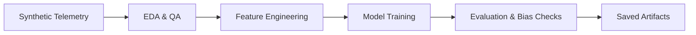
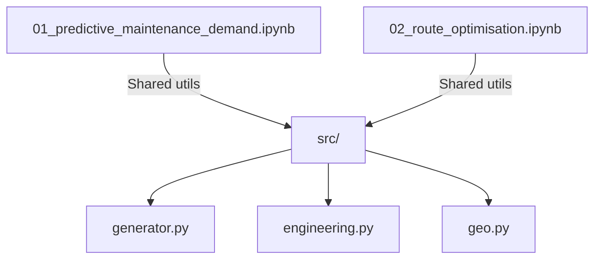

# Project Ugunja — Smart LPG Logistics (Notebook-First)


A production-grade, notebook-centric ML workflow for LPG fleet predictive maintenance, regional shortage prediction, and route optimisation. The project uses physically-informed synthetic telemetry to keep the pipeline fully reproducible without proprietary data.

**Primary notebooks**
- `notebooks/01_predictive_maintenance_demand.ipynb`
- `notebooks/02_route_optimisation.ipynb`

**Key outcomes**
- Predictive maintenance with Random Forest + engineered signals (RUL proxy, stress index, rolling stats).
- Demand/shortage prediction with Logistic Regression and robust evaluation.
- Route optimisation analysis with geo features, risk-aware routing, and visualisation.
- Target accuracy guideline: **~0.89** on synthetic data (exact results vary by seed).

**Pipeline overview**


**Notebook map**


**Repository layout**
```text
ugunja_ml_streamlit/
  notebooks/
    01_predictive_maintenance_demand.ipynb
    02_route_optimisation.ipynb
  src/
    data/
      generator.py
    features/
      engineering.py
    utils/
      geo.py
  models/
  tests/
  requirements.txt
  Dockerfile
  README.md
```

**Quickstart**
```bash
python -m venv .venv
. .venv/Scripts/Activate.ps1
pip install -r requirements.txt
jupyter lab
```

**Docker**
```bash
docker build -t ugunja-ml .
docker run -p 8888:8888 ugunja-ml
```

**Shared modules**
- `src/data/generator.py`: synthetic data generation aligned with the notebooks.
- `src/features/engineering.py`: shared feature engineering for maintenance and route tasks.
- `src/utils/geo.py`: depot/destination config, road conditions, and haversine distance.

**Visual outputs produced in notebooks**
- Feature importance plots for maintenance and shortage models.
- Confusion matrices and classification reports.
- Geo heatmaps and optimised route maps.

**Notes**
- Data is synthetic by design; treat metrics as illustrative, not production benchmarks.
- Model artefacts may be saved into `models/` from within the notebooks.
